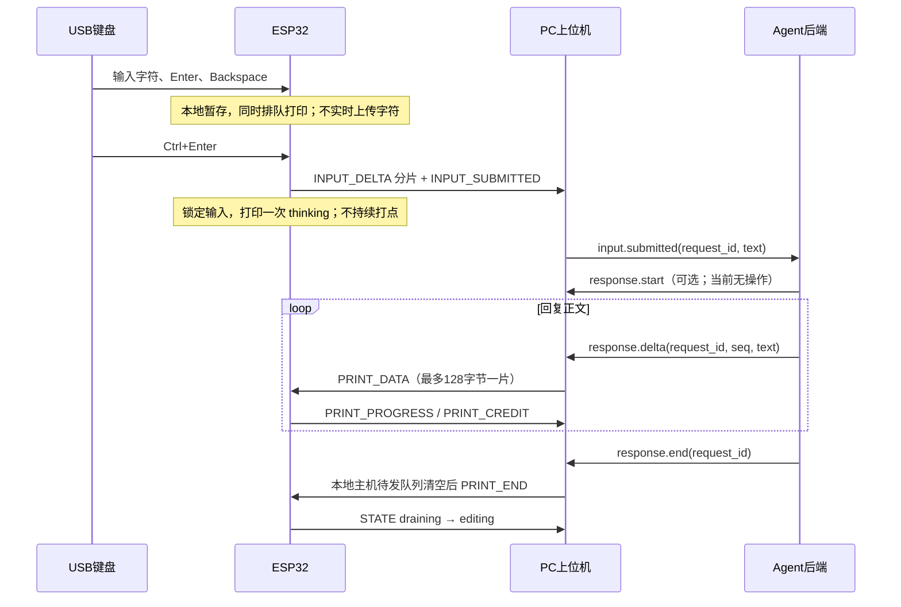

# KX-R530 / ESP32 Agent 后端通信交接文档

核对日期：2026-09-24。本文描述**当前实现**，不是原设计中的目标能力。

源码基线：外层仓库 `859e188`，ESP-IDF 内层仓库 `4752f2b`。本次文档交付不修改运行代码、不刷机。

## 1. 后端接入结论

后端作为 WebSocket 客户端连接 PC 上位机。上位机收到 ESP32 的键盘提交后，发出 `input.submitted`；后端使用同一个 `request_id` 返回 `response.delta`，最后发送 `response.end`。后端不打开 COM5，也不实现 KXR60 时序。

| 链路 | 当前接口 | 职责 |
|---|---|---|
| USB 键盘 → ESP32 | USB OTG Host / Boot HID Keyboard | 本地按键识别、实时纸面输出、本地保存候选文本 |
| ESP32 ↔ PC 上位机 | UART0，115200 / 8N1，COBS + CRC32 | 提交文本、打印数据、设备状态 |
| Agent 后端 ↔ 上位机 | WebSocket JSON，端口 8766 | 用户消息及 Agent 回复流 |
| 运维或测试客户端 → 上位机 | HTTP JSON，端口 8765 | 查询状态、直接打印、取消、恢复 |
| ESP32 → 打字机 | KXR60 GPIO + ACK | 逐字节发送，唯一打印任务消费队列 |

**当前仍是联调版本。** 已有日志证明候选文本曾出现帧缺失；短消息提交帧现已附带正文，但尚不能宣称长消息、重连、取消及高速流式回复有可靠交付保证。特别是：

- 只连接一个负责回复的 Agent；当前服务器会广播给所有 WebSocket 客户端，没有会话所有权仲裁。
- 没有应用层 ACK、重传、幂等保证或可靠续传。不要对已经发送过的正文盲目重试，否则可能重复打印。
- `seq` 当前不去重、不校验顺序。后端要自行保证一个请求只有一个顺序发送协程。
- `HTTP 202`、`print.progress`、`STATE=editing` 都不是纸面打印完成证明。
- `/api/v1/input/submit` 存在参数传递错误，详见第 5 节；优先使用实体键盘 Ctrl+Enter 触发对话，使用 `/api/v1/print` 测试直接输出。

## 2. 启动与连接检查

在 Windows PowerShell 中，从项目外层目录运行：

```powershell
cd C:\Users\Surpr\Documents\ChatGPT\1
python -m pip install -r host\requirements.txt
python -m host.app --port COM5 --debug
```

| 参数 | 默认值 | 行为 |
|---|---|---|
| `--port` | `COM5` | 用户选择的 USB-UART 端口；当前已识别设备为 CH343，端口可能变化 |
| `--baud` | `115200` | 必须与固件 UART 匹配 |
| `--api-port` | `8765` | HTTP 端口；WebSocket 自动为该值 + 1 |
| `--debug` | 关闭 | 输出成功解码的 RX 帧和候选区变化；界面模式下自动连接串口 |

普通 PyQt 模式运行后需要点击“连接”；`--debug` 自动连接。依赖为 Python 3.10+、pyserial、websockets 14+、PyQt6；当前本机验证环境为 Python 3.11。无 PyQt6 时会进入依赖标准输入存活的无界面模式，不是 Windows 服务。

地址：

```text
HTTP     http://127.0.0.1:8765
WS       ws://127.0.0.1:8766/api/v1/agent
```

**实际是两个端口**，不是在 8765 上升级 WebSocket。代码目前没有检查 WS URL path，但调用方统一使用 `/api/v1/agent`。

当前绑定 `127.0.0.1`，没有 CLI 监听地址选项，没有 Bearer Token、TLS、Origin 校验。远程后端不能直接访问这台 PC 的 loopback；若需要远程接入，部署认证隧道或反向代理，把 HTTP 和 WS 两个端口分别转发。不要把原计划中的认证视为已经实现。

检查顺序：

1. 关闭重复上位机和占用 COM5 的 monitor，保留一个实例。
2. 查看启动输出，确认 HTTP 与 WS 都启动。`8766 / Errno 10048` 表示 WS 端口冲突，必须解决后再测。
3. `GET /api/v1/health` 返回 200 只能证明 HTTP 响应，不能证明 WS 或串口可用。
4. `GET /api/v1/state` 中确认 `connected=true`、`device=kxr530-esp32s3`、`state=editing`，并观察新鲜的设备状态。`connected` 只是串口打开状态。
5. 建立 WS 后应收到 `state` 消息，再用键盘提交一次短文本。不要另开第二个串口程序抓包。

## 3. 对话生命周期



### 3.1 输入与提交

- 候选区在 ESP RAM 中，上限 4096 字节；断电/复位丢失。输入时已在纸上输出，后端**不要再把用户原文作为回复回显**。
- 普通 Enter 在纸面发送 `LF CR`（`0A 0D`），候选文本存一个 `LF`（`\n`）。Backspace 修改候选文本末尾，但不能假定纸上字符被擦除。
- Ctrl+Enter 对空候选区无操作；非空时生成 16 字节随机 request_id，进入 `thinking`。
- 本地 `INPUT_DELTA` 分片只在提交时上传。同一提交使用相同 request_id，最后 `INPUT_SUBMITTED` 作为提交事件。
- 长度不超过 480 字节时，提交事件本身还携带完整正文；上位机用它覆盖先前分片拼装结果。超过 480 字节时，提交事件 payload 为空，依赖前置分片。
- 键盘在 `thinking/responding/draining/fault` 时被状态机拒绝，不是排队生成下一条对话。
- ESP 键盘 request_id 是随机 16 字节，不保证 UUID v4 的 version/variant 位。后端应当视作不透明 ID，并原样使用上位机给出的带连字符字符串。

### 3.2 回复与结束

- 首个 `PRINT_DATA` 到达时，打印 ` <秒数>s\r\n`，再打印正文。秒数是从 ESP 接受提交到首次回复数据到达的整秒数，不是模型内部思考时长。
- `thinking` 只打印一次，持续点输出已关闭。
- 后端只发可打印 ASCII 和所需换行。当前上位机不解析 Markdown、不转写中文、不自动转换换行。
- 推荐正文换行明确发送 `\n\r`，与实机键盘的 LF-CR 顺序一致；固件自行追加的 thinking 前缀和结尾仍为 `\r\n`，这是当前实现差异。
- `response.end` 之后 ESP 进入 `draining`，软件队列空时回到 `editing` 并清除 ESP 候选区。上位机保留上次提交内容用于显示。
- 后端未连接、未发结束、生成失败后未处理时，ESP 不会自动超时退出等待。不会持续打点，但仍可能锁定输入。

## 4. WebSocket 协议

每条 WS 文本消息是一整个 JSON 对象，发送 `v:1`。目前服务端没有严格校验 `v`、结构或字段类型；不要发送 JSON 数组、缺失必需字段或格式错误的 JSON。没有 SSE/OpenAI 兼容端点；后端须把自己已有的模型流转换成以下格式。

### 4.1 上位机 → 后端

**连接快照**：每次连接发送一次，后续并不会自动持续广播 `state`；后续状态通过 HTTP 查询。

```json
{"v":1,"type":"state","state":{"connected":true,"port":"COM5","device":"kxr530-esp32s3","state":"editing","candidate":"","queued_bytes":0,"credit":16384,"capacity":16384,"printed_bytes":0,"active_request":null,"last_error":null,"agent_output":"","events":[]}}
```

**用户提交**：用于启动一次 Agent 调用。

```json
{"v":1,"type":"input.submitted","request_id":"615fe93a-bf05-a74e-515c-4c2a828c723e","text":"hello","capabilities":{"output_charset":"ascii"}}
```

如果 WS 建立时 host 已有 `active_request`，会在快照后重发该事件，**即使此前已经回复了一部分，或该请求来自直接打印**。没有 `replay` 标志。后端按 request_id 记录是否已处理；不得因重连而自动再生成和重打正文。

**设备接受输出块**：

```json
{"v":1,"type":"print.progress","request_id":"615fe93a-bf05-a74e-515c-4c2a828c723e"}
```

这是 `PRINT_DATA` 入队后的通知，不包含字节偏移、序号或完成百分比，不能据此确认某个 WS delta 完成，更不是纸面完成。

**错误**：

```json
{"v":1,"type":"device.error","error":"printer_queue_full"}
```

```json
{"v":1,"type":"error","error":"unknown request"}
```

`device.error` 来自 ESP；`error` 来自主机消息处理。两类当前都没有 request_id，且广播到所有 WS 客户端。

### 4.2 后端 → 上位机

| type | 字段 | 当前处理 |
|---|---|---|
| `response.start` | 推荐携带 `v`、`request_id` | 直接返回，无状态变更，也不校验 request_id |
| `response.delta` | `request_id` 字符串、`text` 字符串、`seq` 整数 | request_id 必须等于 host 活动请求；text 转 ASCII，再拆为 ≤128 字节串口块 |
| `response.end` | `request_id` | 标记主机发送结束；待 host pending 队列发完后下发 `PRINT_END` |
| `response.error` | `request_id` | 等价于 `response.end`，错误 message/code 不会被显示或打印 |

```json
{"v":1,"type":"response.start","request_id":"615fe93a-bf05-a74e-515c-4c2a828c723e"}
{"v":1,"type":"response.delta","request_id":"615fe93a-bf05-a74e-515c-4c2a828c723e","seq":0,"text":"Hello!"}
{"v":1,"type":"response.delta","request_id":"615fe93a-bf05-a74e-515c-4c2a828c723e","seq":1,"text":"\n\rHow can I help?"}
{"v":1,"type":"response.end","request_id":"615fe93a-bf05-a74e-515c-4c2a828c723e"}
```

以上四行是四条独立 WS 消息，不是一次发送的多行 JSON。`text` 是**新增片段**，不能每次发送累计全文。

`seq` 默认 0，代码转换为整数后传入 `response_delta()`，目前不参与后续逻辑。建议仍从 0 递增，为未来版本保留兼容性；重复发送同一个 seq 当前仍会重复打印。`response.end` 必须且只应在正文发送完之后发一次，之后不要再发 delta。

### 4.3 错误和重连策略

- `unknown request`：请求 ID 不匹配或已无活动请求；停止该流，查询状态，不要换 ID 继续输出。
- ASCII 编码错误：在后端进入回复流前确定输出字符集；`ensure_ascii=True` 只转义 JSON，不会让解码后的中文变成可打印 ASCII。
- `response buffer full`：已经可能发生部分发送。停止生成，不要重放整个 delta；现接口没有明确的已接收字节偏移。
- `device.error` 或 `state=fault/disconnected`：停止流，保留后端原文和请求记录，等待人工处理。
- WS 断线：可以重连获取状态，但没有断点续打接口。未开始输出且首次收到的请求可正常处理；已经输出过的请求不自动重放。
- 后端应自设生成超时，超时后通过 cancel 流程结束；当前固件没有 Agent 等待超时。
- 目前没有 `cancelled`、`response.ack`、`print.completed` 事件。

## 5. HTTP 接口

POST 使用 `Content-Type: application/json` 和 JSON 对象。响应也是 JSON；不需要认证 header。当前只实现 GET/POST，没有 OPTIONS/CORS，普通服务端客户端可调用，浏览器跨域调用未适配。

| 方法与路径 | 请求体 | 成功响应 | 含义/限制 |
|---|---|---|---|
| `GET /api/v1/health` | 无 | `200 {"ok":true,"ws":"ws://127.0.0.1:8766/api/v1/agent"}` | 仅 HTTP 存活 |
| `GET /api/v1/state` | 无 | `200` 状态对象 | 主机缓存，不是同步向 ESP 读取 |
| `POST /api/v1/print` | `{"text":"HELLO"}` | `202 {"request_id":"..."}` | 主机生成 UUID v4，直接输出；不触发 Agent 生成，随后自动 PRINT_END |
| `POST /api/v1/input/append` | `{"text":"hello"}` | `202 {"accepted":true}` | 向 ESP 编辑区追加并立即打印；单次 ASCII 长度 ≤480 字节，不自动分片 |
| `POST /api/v1/input/submit` | `{"text":"hello"}` 或 `{}` | `202 {"request_id":"..."}` | 当前有实现缺陷，见下文；不要用作可靠后端入口 |
| `POST /api/v1/requests/{request_id}/cancel` | `{}` | `202 {"accepted":true}` | 下发 CANCEL；当前设备未校验 ID 是否匹配活动请求 |
| `POST /api/v1/device/recover` | `{}` | `202 {"accepted":true}` | 重新初始化 KXR60，成功时状态改 editing；不是完整会话重置 |

未知路径返回 `404 {"error":"not_found"}`。处理函数捕获的校验/连接/运行错误统一返回 `409 {"error":"..."}`，并没有区分 400/413/422/503。非法 JSON 结构、非法 Content-Length、某些串口异常等仍可能造成连接异常，而不是结构化错误响应。

**202 是主机函数返回，不是 ESP 确认。** 设备稍后仍可能报告 busy、队列满或故障。`/print` 的本地排队操作也不是原子事务，大请求失败时可能已经部分发送。

### 5.1 当前 submit 参数缺陷

`SerialBridge.send()` 签名为 `send(msg_type, payload=b"", request_id=None)`，而 `DeviceService.submit()` 当前调用 `send(INPUT_SUBMITTED, request_id.bytes)`。

因此 UUID 字节被误放到 payload，串口 request_id 为全零；HTTP 返回的新 UUID 与设备后续发回的 ID 不一致。此外，此路径的设备确认帧为空 payload，不会像实体键盘路径一样附带短正文。该问题尚未在本次文档任务中修复。

### 5.2 状态对象字段

| 字段 | 类型 | 实际语义 |
|---|---|---|
| `connected` | boolean | 串口读线程/端口连接状态；不等于握手、Agent 或打字机均正常 |
| `port` / `device` | string 或 null | 当前端口 / 最近 HELLO 的设备名 |
| `state` | string | disconnected、connecting、editing、thinking、responding、draining、fault |
| `candidate` | string | host 最近收到/拼装的候选或提交内容；输入过程中不代表 ESP 当前缓存 |
| `active_request` | string 或 null | host 活动 ID；来自提交事件或直接打印时本地设置 |
| `queued_bytes` | integer | 最近设备报告的软件打印队列占用 |
| `credit` | integer | 最近 credit 减去主机已尝试发送的正文长度；不是事务化窗口 |
| `capacity` | integer | 最近设备状态报告容量，通常 16384 |
| `printed_bytes` | integer | ESP 累计成功完成 KXR60 ACK 的字节数，包含用户字、控制符、thinking 和正文 |
| `last_error` | string 或 null | 最近错误，可能是旧错误，不保证自动清除 |
| `agent_output` | string | host 累积的回复/直接打印文本；不证明已到设备或已落纸 |
| `events` | string array | 最近最多 100 条主机事件文本 |

UART STATE 另含 `candidate_length` 和 `faulted`，但当前 host 未把这两项作为独立字段暴露在 HTTP/WS 快照中。状态缺少时间戳、boot ID、HID 连接标志、思考时长、未发 host 字节数。

### 5.3 PowerShell 示例

```powershell
Invoke-RestMethod http://127.0.0.1:8765/api/v1/health
Invoke-RestMethod http://127.0.0.1:8765/api/v1/state

# 会产生实际纸面输出；仅在需要打印时执行。
$body = @{ text = "HELLO WORLD" } | ConvertTo-Json
$job = Invoke-RestMethod http://127.0.0.1:8765/api/v1/print `
  -Method Post -ContentType 'application/json' -Body $body
$job.request_id

# 取消时先停止后端生产新的 delta，再检查当前请求和状态。
Invoke-RestMethod "http://127.0.0.1:8765/api/v1/requests/$($job.request_id)/cancel" `
  -Method Post -ContentType 'application/json' -Body '{}'
```

## 6. UART 协议（固件与上位机维护方）

### 6.1 物理链路

UART0，115200 baud、8 data bits、no parity、1 stop bit、无 RTS/CTS 流控。ESP32-S3 默认 TX GPIO43 / RX GPIO44，经板载 USB-UART 到 PC；当前 COM5。USB OTG Host 键盘使用 GPIO19/20，不能与同一内部 PHY 的 USB Serial/JTAG 同时按两个独立 USB 口使用。

COM 号不是设备身份。当前程序没有自动按 VID/PID/序列号选择端口，也没有自动重连串口；由启动参数或 UI 选择。

### 6.2 帧布局

```text
wire = COBS(raw) + 0x00
raw  = version | type | flags | request_id | sequence | payload_length | payload | crc32
```

| 偏移 | 长度 | 字段 | 编码 |
|---:|---:|---|---|
| 0 | 1 | version | 1 |
| 1 | 1 | type | 消息编号 |
| 2 | 1 | flags | 当前发送 0；接收未定义其他语义 |
| 3 | 16 | request_id | 原始字节；无请求时全零 |
| 19 | 4 | sequence | uint32 little-endian |
| 23 | 2 | payload_length | uint16 little-endian |
| 25 | N | payload | 消息决定为 ASCII、JSON 或原始字节 |
| 25+N | 4 | crc32 | uint32 little-endian |

raw 长度 `29 + N`，N 最大 480，因此当前合法 raw 最大 509 字节。ESP 解码缓冲为 512、编码缓冲为 560；这些是缓冲上限，不是每帧固定长度。CRC 计算在 COBS 前：初值 `FFFFFFFF`，反射多项式 `EDB88320`，最后取反；Python 等价于 `zlib.crc32(raw_without_crc) & 0xffffffff`。

UUID 字节使用 `uuid.UUID(id).bytes`，不能用 `bytes_le`。序号由两个方向各自计数，和 WS delta 的 seq 无关，可能跨请求连续。当前没有 ACK 序号、重发去重或丢序自动处理。

接收端按零字节分帧再 COBS decode，验证版本、长度和 CRC。坏帧静默丢弃，无 NACK。当前 `--debug` 只打印成功解码的帧，不记录原始 RX 数据或 CRC 拒绝原因；日志序号跳跃只证明没处理到该帧，不能单凭它确定丢失原因。

可复现 PING 向量（type=13、flags=0、ID 全零、seq=1、payload=`hello`）：

```text
03 01 0d 01 01 01 01 01 01 01 01 01 01 01 01 01 01 01 01
02 01 01 01 02 05 0a 68 65 6c 6c 6f 16 02 55 c5 00
```

使用现成编码器，不自行拼 JSON 到串口：

```python
from host.protocol import PING, encode_frame, Decoder
wire = encode_frame(PING, payload=b"hello", sequence=1)
frames = Decoder().feed(wire)
assert frames[0].payload == b"hello"
```

### 6.3 消息表

方向中的 H=PC 上位机，E=ESP。

| ID | 类型 | 方向 | payload 与处理 |
|---:|---|---|---|
| 1 | HELLO | E→H | JSON 设备信息；启动发送，此后每约 2 秒发送 |
| 2 | HELLO_ACK | H→E | 空；设备发送 STATE 和 PRINT_CREDIT，不取消 HELLO 定时广播 |
| 3 | STATE | E→H | JSON 状态；ID 通常全零 |
| 4 | INPUT_DELTA | H↔E | H→E 编辑区追加并打印；E→H 是电脑输入回显，或 Ctrl+Enter 时一次性上传的分片 |
| 5 | INPUT_SUBMITTED | H↔E | H→E 提交本地非空候选区；E→H 是提交事件，键盘短消息含正文，详见下文 |
| 6 | PRINT_DATA | H→E | 打印数据；host 每片 ≤128，协议允许 ≤480；设备在 editing 可直接启动打印，活动期间 ID 必须匹配 |
| 7 | PRINT_END | H→E | 空；活动 ID 匹配时追加 CRLF 并进入 draining；也支持 thinking 时空回复结束 |
| 8 | PRINT_CREDIT | E→H | `{"credit":16384,"queued":0}`；约每 500ms，及握手/数据入队后报告 |
| 9 | PRINT_PROGRESS | E→H | 空，ID 为活动请求；数据入队后立即发送，不是字符已完成 |
| 10 | RECOVER | H→E | 空；重新初始化 KXR60，成功→editing，失败→fault |
| 11 | CANCEL | H→E | 空；在 thinking/responding/draining 尝试清空设备队列，清候选与 ID，回 editing；当前忽略请求 ID 匹配 |
| 12 | ERROR | E→H | `{"error":"错误码"}`；相关请求 ID 在帧头，host 转发时未保留 |
| 13 | PING | H→E | 任意 ≤480 字节 |
| 14 | PONG | E→H | 同 ID、同 payload；使用 ESP 自己的新序号，host 服务目前不转为公开事件 |

HELLO 示例：

```json
{"device":"kxr530-esp32s3","protocol":1,"charset":"ascii","printer_capacity":16384}
```

STATE 示例（此对象与 HTTP 快照不是同一个 schema）：

```json
{"state":"editing","candidate_length":17,"queued_bytes":0,"capacity":16384,"printed_bytes":17,"faulted":false}
```

### 6.4 提交分片与字符语义

键盘提交次序：`INPUT_DELTA(ID, chunk...)` → `INPUT_SUBMITTED(ID, full_text_or_empty)` → `STATE`。每片最多 480 字节，分片前没有总长度、偏移或整条消息哈希。host 看到新的非零分片 ID 时清候选并开始拼接；短提交帧的完整 payload 会覆盖拼接结果，避免同一内容拼两次。

大于 480 字节的提交依赖所有分片成功接收，没有补片能力。最后提交事件本身也没有可靠 ACK/重试。短消息冗余改善了缺一个分片时的表现，不保证交付。

键盘本地保存 LF、Tab、ESC 等控制字节的可能性与网络打印允许集不同：设备 `PRINT_DATA/INPUT_DELTA` 只允许 `20..7E`、`08`、`0A`、`0D`；Tab `09`、ESC `1B`、DEL `7F`、NUL `00` 会拒绝。host `.encode('ascii')` 只检查是否属于 ASCII，不检查控制字符允许集，所以最终可能由设备返回错误。后端应主动约束输出为可打印 ASCII 加 LF/CR。

ESP 本地候选区满后，当前可能仍打印后续按键而不再保存，没有强制阻止/可见的完整性错误。不要承诺 4096 字节以上文本完整提交。

## 7. 队列、流控与完成语义

| 层 | 容量 | 当前行为 |
|---|---:|---|
| HID 动作队列 | 1024 项 | USB 报告解析后非阻塞入队；满时记录警告，可能丢动作 |
| ESP 候选区 | 4096 字节 | RAM 暂存，Ctrl+Enter 上传 |
| UART RX / TX 驱动缓冲 | 各 4096 字节 | 与打印队列独立 |
| ESP 打印 StreamBuffer | 16384 字节 | printer_task 逐字节处理；enqueue 最多等待 1000ms |
| host 待发回复队列 | 检查上限 262144 字节 | credit 不足的块排队；超限抛异常 |
| host `agent_output` | 未设置上限 | 内存中累计完整回复文本 |

host 收到绝对 `credit` 后覆盖本地 credit，每次直接发送减去该块长度；等待队列随后按 credit 尝试发出，结束标志在 host 待发队列空后下发。**当前没有暂停读取 WebSocket 来实现端到端背压**，只是把回复暂存在 PC；不要称为无损流控。

已确认的实现风险：

1. credit 不包含已发但 ESP 尚未处理的块；旧 credit 报告可能重新放大可发送窗口。
2. 有旧 pending 块时，新短块仍可能直接发送，存在超越旧块的顺序风险。
3. pending 超限、串口异常、入队超时都不是原子回滚；部分正文可能已经到设备。
4. StreamBuffer 入队可能部分成功，错误码未包含已接收长度。
5. `PRINT_END` 没有可靠 ACK；后端 end 不等于设备结束，更不等于纸上完成。
6. 队列空可能仍有一个字节正在 KXR60 握手；固件据队列空切回 editing，并无机械完成传感器。

当前联调建议：先用短回复、小 delta、单请求验证；长回复在后端先保留原文并限制总量。若要求任意长度高速流稳定无丢失/乱序，需要先完善应用层窗口、ACK/重传、FIFO 和完成事件，不能靠固定 sleep 得到可靠保证。

### 7.1 cancel / recover 的实际边界

取消前必须先停止 Agent 继续产生 delta。当前 CANCEL 未核对设备活动 ID，且 host 没有同步清除 `_pending/_end_pending`；之后收到 credit 仍可能继续发送旧正文。`printer_flush()` 也没有确认 StreamBuffer reset 成功，已取出的字节或机械动作无法撤回。因此不能把 `202 accepted` 当作“已静止”。需观察状态和队列，并人工确认。

RECOVER 用于故障诊断后的 KXR60 重新初始化，不会清空候选区、请求 ID、主机待发数据，也不保证打字机半字节状态已恢复。未修复前不要用它当作自动取消/通用重试。

## 8. KXR60 底层边界

后端不需要实现本节，仅用于排障。ESP 信号：ONLINE GPIO47、TXD GPIO2、STB GPIO42、ACK GPIO1，经 LS07 接口电路到打字机。

每字节先等 ACK LOW；ONLINE 拉 LOW；D0→D7 逐位设置 TXD，至少等待 50µs，STB LOW→等待 ACK HIGH→STB HIGH→等待 ACK LOW；最后释放 ONLINE/STB/TXD 为 HIGH。每个 ACK 阶段默认超时 500ms，可由 Kconfig 调整。超时释放线路、锁定 fault，不自动重发半字节。

`printed_bytes` 只统计成功握手的字节，包含控制字节。它不能证明纸面字符数或纸张、色带等机械状态。ACK 故障须检查 On-Line 状态和接线，再决定是否恢复。

## 9. 最小 Agent 客户端示例

下面是**同机短回复联调示例**，连接后不会主动生成测试提交，只响应真实 `input.submitted`。收到用户提交后会产生实际打印。它对重放请求去重，但不演示自动续传；进程重启后的去重记录应由正式后端持久化。

```python
import asyncio
import json
from websockets.asyncio.client import connect

URI = "ws://127.0.0.1:8766/api/v1/agent"

async def main():
    handled = set()
    async with connect(URI) as ws:
        async for raw in ws:
            event = json.loads(raw)
            kind = event.get("type")
            if kind in {"error", "device.error"}:
                raise RuntimeError(event)
            if kind != "input.submitted":
                print(event)
                continue
            rid = event["request_id"]
            if rid in handled:
                print("Already handled; do not reprint:", rid)
                continue
            handled.add(rid)
            if not event.get("text"):
                print("Empty submission; inspect logs before generating:", rid)
                continue
            print("User:", event["text"])
            # 正式后端在此调用 Agent；只向设备发送最终正文流。
            # 不要把工具调用参数、内部推理事件或累计全文当作 delta。
            reply = "Received."
            await ws.send(json.dumps({"v": 1, "type": "response.start",
                                      "request_id": rid}))
            await ws.send(json.dumps({"v": 1, "type": "response.delta",
                                      "request_id": rid, "seq": 0, "text": reply}))
            await ws.send(json.dumps({"v": 1, "type": "response.end",
                                      "request_id": rid}))

asyncio.run(main())
```

正式实现还需并行接收错误/取消与生产 Agent 流、生成超时、持久化去重、断线停止输出。示例不会替你解决目前桥接层的流控问题。

## 10. 排障和联调验收

| 现象 | 证据与处理 |
|---|---|
| 8766 `Errno 10048` | WS bind 失败；不能继续把该实例当作可用 Agent 服务。只保留一个 host.app，或用 `--api-port 18765` 同时迁移 HTTP/WS 到 18765/18766 |
| HTTP 返回 501 Unsupported POST | 很可能请求到了别的 HTTP 服务；检查端口占用和 `/health` 响应身份 |
| `coroutine ... was never awaited` / loop closed | WS 线程异常退出后，串口回调仍向关闭的 loop 广播；异常可能结束串口读取线程。先处理 WS 启动错误 |
| 有提交日志，文本空 | 对比 UART STATE 的 `candidate_length`、type=4 分片及 type=5 payload；跳序不等于缓冲为空 |
| 字符串口帧缺失 | 当前固件仍有 ESP_LOG 输出，默认 UART INFO 日志可能与二进制帧混流；`s_tx_mutex` 不保护日志。此为需核查的风险，不是已验证的唯一原因 |
| 一直 connecting | 检查 HELLO(1)→HELLO_ACK(2)→STATE(3)；当前 HELLO 每约2秒广播，但 debug 只记录 RX，不记录 TX |
| 一直 thinking | 检查 Agent 是否真的连接 8766、是否发 end。点输出已禁用；输入锁定不会自动超时解除 |
| 收到 progress 但纸上不完整 | progress 仅入队；检查 fault、ACK 与实际纸面，不能当作打印成功 |

建议在交付正式后端前完成以下验收，并分别记“模拟通过”与“实机通过”：

1. HTTP、WS、COM5 单实例启动，无端口冲突；串口断开后能明确暴露 disconnected。
2. 本地输入期间不上传字符；Ctrl+Enter 后后端 text 与原文一致，且已提交区域保留。
3. 分别测试 1、17、480、481、4096 字节，包含重复字母、换行、Backspace；验证跨帧拼装，不只测 HELLO。
4. 同一 request_id 顺序响应，用户输入不重复打印；ASCII 外字符和不允许控制字符有可观察错误。
5. 慢打字机、快速 Agent、大于16KiB 回复验证零丢失和顺序；当前不能视作已通过。
6. WS 重连重放事件不重复生成；串口断线不自动重打不可确认的正文。
7. 故障、取消、恢复后没有旧 pending 数据重新打印；当前实现需修复后再验收。
8. 后端结束与设备回 editing 可观察，明确这是软件状态而非机械完成证明。

当前仓库仅有 3 个 Python 测试：COBS 往返、坏帧后恢复、有限 credit 下分片与 end 顺序。此前构建、刷写 Hash 校验和 HELLO 收包成功，不等于上面全部场景通过；最近短提交 payload 修复还需要实体键盘端到端验证。

## 11. 源码定位与下一步责任

| 位置 | 负责内容 |
|---|---|
| `host/api.py` | HTTP 路由、WS 消息、重连快照/事件重放 |
| `host/bridge.py` | ID 管理、候选拼装、串口线程、credit 和 pending 队列 |
| `host/protocol.py` | Python COBS、CRC、帧编解码 |
| `host/app.py` | PyQt 显示、按钮、串口连接与 debug 参数 |
| `espidf/main/app_main.c` | 设备状态机、本地提交与 UART 消息处理 |
| `espidf/main/usb_keyboard.c` | HID 报告、1024项动作队列、Ctrl+Enter 事件 |
| `espidf/main/protocol.c/.h` | C 端帧格式与编号 |
| `espidf/main/printer.c` | 打印 StreamBuffer、发送任务、flush/recover |
| `espidf/components/kxr60/` | GPIO、ACK、超时与故障锁定 |

后端接入方负责：一个 WS 输出者、请求 ID 去重、纯正文 delta、ASCII 输出策略、超时、保存原文与任务记录。

桥接/固件维护方后续优先修复：WS 启动失败传播和广播隔离、二进制与日志隔离、HTTP submit 的 ID 参数、可靠提交分片、事务化流控/FIFO、可靠取消、完成状态与重连恢复。

旧 `espidf/docs/keyboard-and-host-handoff.md` 描述的是更早的键盘阶段，其中“不上传键盘内容”已被当前“Ctrl+Enter 时批量上传”替代。后端按本文基线对接，不要混用旧 handoff 与原始架构计划。
